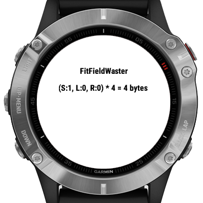
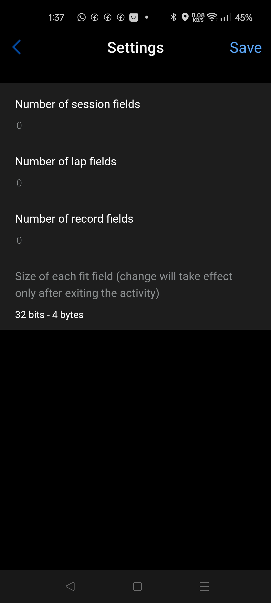

# Fit Field Waster DF

## Usage

This data field is for CIQ developers. As the name suggests it is to "waste" fit fields and/or the total amount of fit bytes in order to test how another datafield behaves.

1. Install Fit Field Waster DF to your device and add it to one of your activities' layout.
2. Open the settings in ConnectIQ app.
3. Edit the number of session, lap, record fields and the field size.
4. Save the settings.

NOTE: only increase the number of fields while the data field is running (while looking at the layout - either before or after starting the activity). If you decrease any of them, then restart the data field.
NOTE: the change of the field size only takes effect next time the data field starts (after you restart the data field).

To restart the data field: You need to exit the activity, then enter it again.

If you like the app you can thank me by sending a beer: https://paypal.me/GavrielF or at least write a positive review with 5 stars ⭐⭐⭐⭐⭐.

## Screenshots

# Changelog

1.2 (2024-07-03) create fields in constructor to make it possible to crash the "other" data field and not this

1.0 (2024-07-03) initial version
